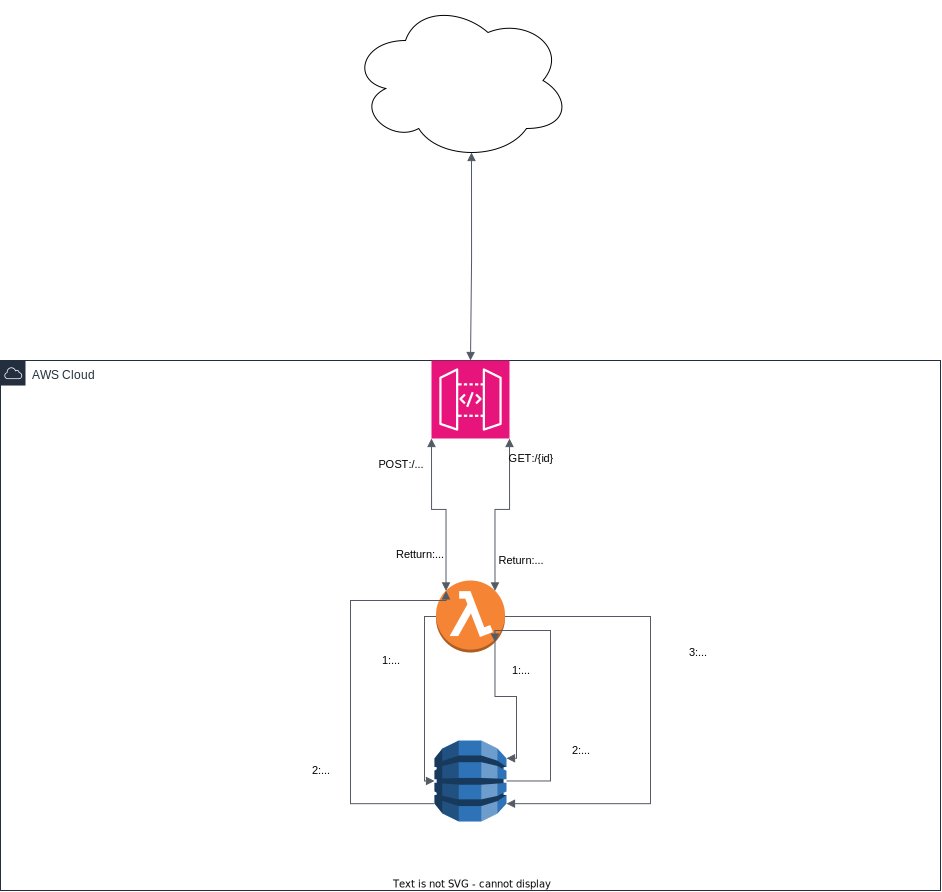

# Burn After Read

## Intro

Über den Service kann eine Nachricht zum einmaligen Lesen gespeichert werden.
Es wird eine eindeutige URL zurückgegeben, die an den Empfänger gesendet werden kann.

## Aufbau

Der Code ist (noch) relativ simpel gehalten, es wird noch nicht auf Fehler geprüft.
Auch wird die Benutzereingabe (noch) nicht validiert – dies sind beides noch offene Aufgaben für die Zukunft.

Ansonsten ist der Service als Monolith in Python für AWS Lambda geschrieben und nutzt als Storage DynamoDB.
Für die Anbindung an AWS wird `boto3` (AWS-SDK) genutzt.
Beide Routen (GET:`/{id`} und POST) werden innerhalb der gleichen Lambda-Funktion abgearbeitet.
Die Routen werden durch ein AWS API-Gateway bereitgestellt, welches wiederum auf die Funktion zeigt.

### Nachricht abrufen (GET)

Bei GET wird die »*id*« als URL-Parameter übergeben.
Sofern die *id* korrekt ist, wird anschließend die Nachricht zurückgegeben und diese in der Datenbank gelöscht.
Bei nichtvorhandenen Ids – sei es, weil diese falsch geschrieben wurde, oder bereits gelöscht wurde – wird eine kurze Fehlermeldung zurückgegeben.

### Nachricht speichern (POST)

Um eine Nachricht zu speichern, wird diese als Plaintext im Body per POST-Anfrage an den API-Gateway-Endpunkt übermittelt.
Die Funktion liest die Nachricht aus dem Body aus und speichert sie unter einer generierten Id in der Datenbank.
Anschließen wird dem Benutzer eine Meldung zurückgegeben, in der die URL zum einmaligen Lesen der Nachricht enthalten ist.

## Installation

Leider gibt es noch keine Automatisierung für diesen Schritt, so dass man die nötige Infrastruktur noch manuell erstellen muss:

1. Es muss ein DynamoDB-Table erstellt werden, deren Name frei wählbar ist. Als `Partition Key Name`  »id« eintragen und als Datentyp »String« einstellen. Die Default Settings können beibehalten werden.
2. Nun kann eine AWS Lambda-Funktion angelegt werden: Als Runtime »Python 3.11« auswählen und einen Funktionsnamen vergeben, ebenfall frei wählbar.

   Unter »Change default execution role« wählt man nun »Create a new role from AWS policy templates«, vergibt einen Namen für die Rolle und als »Policy template« kann man »Simple Microservices permissions – DynamoDB« wählen.
3. Als API-Gateway wählt man ein `HTTP API`. Hier gilt es jetzt wieder einen Namen zu wählen und mit »Add integration« werden jetzt zwei Routen angelegt:
   - Im ersten Dropdown-Menu wählt man als Quelle »Lambda« aus, in den dann erscheinenden Zeile wählt man seine AWS-Region und die entsprechende, in Schritt 2 angelegte Lambda-Funktion aus.
   - Nachdem man mit »Next« ins nächste Fenster gewechselt ist, konfiguriert man nun die Routen. Für den GET-Endpunkt stellt man die Methode natürlich auf »GET«. Der »Resource Path« wird als `/{id}` eingetragen und das »integration target« ist die Lambda-Funktion.
   - Mittels »Add route« legt man anschließen noch den Endpunkt zur Abfrage der Nachricht an, hier sind die Einstellungen: POST als Methode, Pfad ist `/` und das Ziel ist wieder die Lambda-Funktion.
   - Die Stage im nächsten Schritt wird bei den Standard-Einstellungen belassen.
   - Nun kann man noch einmal alle vorgenommenen Einstellungen begutachten und mit einem Klick auf »Create« bestätigen.
4. Nun müssen noch zwei Änderungen in der Funktion selbst gemacht werden, dazu öffnet man sie in Lambda. Im Python-Quelltext werden in den Zeile 5 und 6 zwei Konstanten definiert, die jetzt angepasst werden müssen:
    1. Als `BASEURL` wird die URL des API-Gateways eingetragen. Diese findet man, wenn man im Menü des Gatways auf »API« klickt. Sie ist dort als »Invoke URL« der »$default«-Stage gelistet.
    2. Als `TABLENAME` wird der Name der in Schritt 1 erstellten DynamoDB-Tabelle eingetragen.

## Schematische Darstellung

